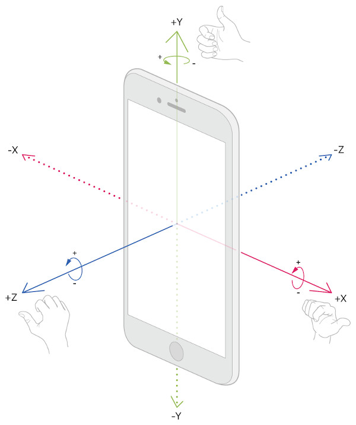

# Источники энтропии 

Современный цифровой мир, пользующийся различными возможностями глобальной сети Интернет, невозможно представить без средств безопасности, обеспечивающих её работу. Среди таких средств особенно распространены криптография с симметричным и ассиметричным ключом, электронная цифровая подпись. Их безопасное применение требует выполнения различного рода условий, одним из которых является проведение независимого равновероятного выбора ключа. Такое условие тесно связано с применением другого криптографического примитива – генератора случайных чисел.
Генераторы случайных чисел требует наличия источника энтропии, являющимся необходимым элементом случайности, отличающий генератор случайных чисел от генератора псевдослучайных чисел. Наличие хорошего источника энтропии позволяет криптографическим системам обеспечить выполнение таких условий, как независимый равновероятный выбор ключа.

## Цели и задачи

Целью данной работы является нахождение наиболее качественных источников энтропии в мобильных устройствах так, что в дальнейшем их можно будет использовать в прикладных задачах криптографии в качестве элемента для различных криптопримитивов. Будут решаться задачи поиска и исследования возможных источников энтропии, получение их статистических характеристик и сравнение.

## Источники энтропии

Обозначим источники энтропии, которые будут представлять для нас интерес и исследованием которых мы будем заниматься:

- Прикосновения, нажатия
- Географическое местоположение
- Положение в пространстве
- Акселерометр
- Гироскоп
- Магнитометр
- Альтиметр
- Микрофон

Далее для некоторых источников будет приведена дополнительная информация, которая окажется полезной при исследовании.

**Прикосновения, нажатия.** Пользовательское взаимодействие с интерфейсом посредством касаний реализовано с помощью фреймворка UIKit.

**Географическое местоположение.** Фреймворк Core Location, предоставляет доступ к значениям, получаемых с GPS, ГЛОНАСС, представляющих из себя географические координаты – пару (широта, долгота).

**Положение в пространстве.** Положение в пространстве описывается с помощью углов Эйлера. На картинке система координат (x, y, z) с помощью поворотов на углы (α, β, γ) описывает положение, заданное векторами (X, Y, Z).

**Акселерометр.** Акселерометр измеряет ускорения вдоль каждой оси в единицах ускорения свободного падения, т.е. 1.0 соответствует 9,8 м/с2. Значения могут быть положительными или отрицательными в зависимости от направления ускорения.

**Гироскоп.** Гироскоп измеряет скорость, с которой устройство вращается вокруг оси. Значения вращений измеряются в радианах в секунду вокруг заданной оси и могут быть положительными или отрицательными в зависимости от направления вращения.

**Магнитометр.** Магнитометр – позволяет получить измерения магнитного поля Земли, относительно положения устройства.

**Альтиметр.** *Добавить информацию.*

**Микрофон.** *Добавить информацию.*

## Программная реализация

В данном разделе будут описаны особенности программных реализаций, с помощью которых будут проводиться статистические исследования источников энтропии.

**Представление исходных данных.** Значения, получаемые с источников, будут иметь тип Double, являющийся 64-битным типом с плавающей точкой, в котором 1 бит – бит знака, следующие 11 бит – экспонента и оставшиеся 52 бит - мантисса. Случайное число будет формироваться на основе младших, или, в случае, если используется не вся точность типа, старших битов мантиссы.

**Прикосновения, нажатия.** Для работы с данным источником используется фреймворк UIKit. Ввиду того, что исходными данными источника являются координаты нажатия на экране, то для получения случайного числа необходимого размера используется совмещение значащих битов от каждой координаты.
Источник генерирует значения во время того, как пользователь взаимодействует с элементами интерфейса.
Способ формирования 32-битного случайного числа: старшие 16 бит мантиссы координаты x + старшие 16 бит мантиссы координаты y.

**Географическое местоположение.** Поскольку источник генерирует сразу два точных значения – широту и долготу, то за один шаг работы источника формируется сразу два числа. Источник создаёт новые значения при изменении местоположения.   
Способ формирования 32-битного случайного числа: младшие 32 бита мантиссы широты (долготы).

**Положение в пространстве.** Из трёх значений величин углов Эйлера, описывающих положение устройства в пространстве, источник формирует 3 случайных числа. Значения обновляются 60 раз в секунду.
Способ формирования 32-битного случайного числа: младшие 32 бита мантиссы одного из углов Эйлера.

**Акселерометр.** Источник генерирует три значения, соответствующие проекциям ускорения, на оси, которые обновляются 60 раз в секунду.
Способ формирования 32-битного случайного числа: старшие 32 бита мантиссы одного из трёх ускорений.

**Гироскоп.** Данный источник производит три значения, являющиеся частотами вращений вокруг координатных осей. Их обновление происходит 60 раз в секунду.
Способ формирования 32-битного случайного числа: младшие 32 бита мантиссы одной из трёх частоты.

**Магнитометр.** Источник формирует значения ориентации устройства, относительно земного магнитного поля. Новые значения характеристик магнитного поля появляются 60 раз в секунду.
Способ формирования 32-битного случайного числа: старшие 16 бит мантиссы значения магнитного поля по оси x + старшие 16 бит мантиссы значения магнитного поля по оси y.

**Альтиметр.** Источник генерирует значение высоты над уровнем моря. Обновление происходит при изменении местоположения.
Способ формирования 32-битного случайного числа: старшие 32 бита мантиссы.

**Микрофон.** Источник генерирует последовательность бит, из которой переодически извлекается 32-битное число.
Способ формирования 32-битного случайного числа: из выходящего потока.

## Статистическое исследование

В текущем разделе будут рассмотрены статистические характеристики исследуемых источников энтропии для выборок размером 100, 400 и 1600 элементов.

#### Прикосновения, нажатия
 Для источника энтропии «Прикосновения, нажатия» рассмотрим выборки и их статистические характеристики.

| Размер выборки                              | 100                 | 400                 | 1600                |
|---------------------------------------------|---------------------|---------------------|---------------------|
| Гипотеза Хи\-квадрат                        | Отклонена           | Отклонена           | Отклонена           |
| Относительное смещение выборочного среднего | 27\.19%             | 5\.40%              | 15\.35%             |
| Относительное смещение выоброчной дисперсии | 3\.37%              | 12\.06%             | 10\.63%             |

Построим гистограммы частот.

На третьей гистограмме особенно заметно преобладание малых значений.

#### Географическое местоположение
Для источника энтропии «Гироскоп» рассмотрим выборки и их статистические характеристики.

| Размер выборки                              | 100                 | 400                 | 1600                |
|---------------------------------------------|---------------------|---------------------|---------------------|
| Гипотеза Хи\-квадрат                        | Принята             | Принята             | Принята             |
| Относительное смещение выборочного среднего | 2\.45%              | 0\.53%              | 3\.14%              |
| Относительное смещение выоброчной дисперсии | 11\.77%             | 4\.03%              | 2\.66%              |

Построим гистограммы частот.

Вторая и третья гистограммы демонстрируют хорошее распределение генерируемых источником чисел.

#### Положение в пространстве
Для источника энтропии «Положение в пространстве» рассмотрим выборки и их статистические характеристики.

| Размер выборки                              | 100                 | 400                 | 1600                |
|---------------------------------------------|---------------------|---------------------|---------------------|
| Гипотеза Хи\-квадрат                        | Отклонена           | Принята             | Принята             |
| Относительное смещение выборочного среднего | 8\.47%              | 2\.48%              | 0\.03%              |
| Относительное смещение выоброчной дисперсии | 12\.79%             | 6\.88%              | 1\.62%              |

Построим гистограммы частот.

Здесь хорошо видна равномерная тенденция к распределению чисел, при которой выборки размером 400 и 1600 удовлетворяют критерию Хи-квадрат с гипотезой о равномерном распределении.

#### Акселерометр
Для источника энтропии «Акселерометр» рассмотрим выборки и их статистические характеристики.

| Размер выборки                              | 100                 | 400                 | 1600                |
|---------------------------------------------|---------------------|---------------------|---------------------|
| Гипотеза Хи\-квадрат                        | Отклонена           | Отклонена           | Отклонена           |
| Относительное смещение выборочного среднего | 27\.17%             | 14\.75%             | 10\.13%             |
| Относительное смещение выоброчной дисперсии | 11\.29%             | 0\.02%              | 3\.18%              |

Построим гистограммы частот.

На каждой гистограмме заметно снижение частот пропорционально увеличению числа.

#### Гироскоп
Для источника энтропии «Гироскоп» рассмотрим выборки и их статистические характеристики.

| Размер выборки                              | 100                 | 400                 | 1600                |
|---------------------------------------------|---------------------|---------------------|---------------------|
| Гипотеза Хи\-квадрат                        | Принята             | Принята             | Принята             |
| Относительное смещение выборочного среднего | 2\.18%              | 0\.47%              | 0\.31%              |
| Относительное смещение выоброчной дисперсии | 8\.22%              | 3\.52%              | 1\.69%              |

Построим гистограммы частот.

На третьей гистограмме особенно заметно равновероятность, генерируемых чисел.

#### Магнитометр
Для источника энтропии «Магнитометр» рассмотрим выборки и их статистические характеристики.

| Размер выборки                              | 100                 | 400                 | 1600                |
|---------------------------------------------|---------------------|---------------------|---------------------|
| Гипотеза Хи\-квадрат                        | Принята             | Отклонена           | Отклонена           |
| Относительное смещение выборочного среднего | 6\.07%              | 1\.81%              | 12\.14%             |
| Относительное смещение выоброчной дисперсии | 18\.51%             | 7\.79%              | 14\.87%             |

Построим гистограммы частот.

Из гистограммы № 3 легко видеть резкое преобладание частот в области небольших чисел и хорошую равномерность частот при прочих значениях.

#### Альтиметр
Для источника энтропии «Альтиметр» рассмотрим выборки и их статистические характеристики.

| Размер выборки                              | 100                 | 400                 | 1600                |
|---------------------------------------------|---------------------|---------------------|---------------------|
| Гипотеза Хи\-квадрат                        | Отклонена           | Отклонена           | Отклонена           |
| Относительное смещение выборочного среднего | 13\.37%             | 8\.31%              | 14\.31%             |
| Относительное смещение выоброчной дисперсии | 7\.31%              | 13\.59%             | 6\.76%              |

Построим гистограммы частот.

Полученные гистограммы хорошо демонстрируют отсутствие равномерности значений, выдаваемых источником энтропии. В третьей выборке заметно преобладание малых значений.

#### Микрофон
Для источника энтропии «Микрофон» рассмотрим выборки и их статистические характеристики.

| Размер выборки                              | 100                 | 400                 | 1600                |
|---------------------------------------------|---------------------|---------------------|---------------------|
| Гипотеза Хи\-квадрат                        | Принята             | Отклонена           | Отклонена           |
| Относительное смещение выборочного среднего | 5\.60%              | 9\.34%              | 12\.76%             |
| Относительное смещение выоброчной дисперсии | 11\.79%             | 0\.12%              | 1\.91%              |

Построим гистограммы частот.

На гистограмме № 3 видна наибольшая встречаемость случайных чисел в области первой четверти промежутка. Далее частота чисел постепенно снижается по мере увеличения чисел.

## Заключение

В ходе выполнения индивидуального задания производственной практики удалось найти и исследовать следующие источники энтропии:
- Прикосновения, нажатия
- Географическое местоположение
- Положение в пространстве
- Акселерометр
- Гироскоп
- Магнитометр
- Альтиметр
- Микрофон

По результатам статистических исследований для обозначенных источников энтропии, наилучшими оказались источники
- положение в пространстве
- гироскоп
- географическое местоположение

Критерий Хи-квадрат о равномерном распределении для первого источника был выполнен для 2 из 3 выборок, для второго и третьего для всех трёх. У прочих источников энтропии критерий или не был выполнен ни для одной выборки, или был выполнен только для первой выборки, имеющей по сравнению с остальными выборками наименьший размер.

Таким образом, обозначенные наиболее качественные источники энтропии можно будет применять при решении криптографических задач, обеспечивая разрабатываемую криптосистему необходимым количеством случайности, или иначе – энтропии.

## Технические особенности
 - архитектура приложения – SOA (Service-Oriented Architecture)
 - архитектура слоя представления – MVC (Model-View-Controller)

## Примечание
Данный текст является адаптированной версией избранных разделов отчёта по производственной практике, которая проходила в компании «[Актив](https://www.aktiv-company.ru/)» в июле 2019 года.

**Структура отчёта.** Избранные разделы отмечены галочкой.
- [x] Введение
- [x] Цели и задачи
- [ ] Изучение технической документации
- [ ] Поиск возможных источников энтропии
- [x] Сбор информации о найденных источниках энтропии
- [x] Программная реализация средств исследования
- [x] Статистическое исследование источников энтропии
- [ ] Выбор наиболее качественных источников энтропии
- [x] Заключение

## Авторы
* [Зорькин Андрей](https://github.com/zooorkin)

## Лицензия
* EntropyApp доступна по лицензии MIT. Смотрите файл [LICENSE](LICENSE).
